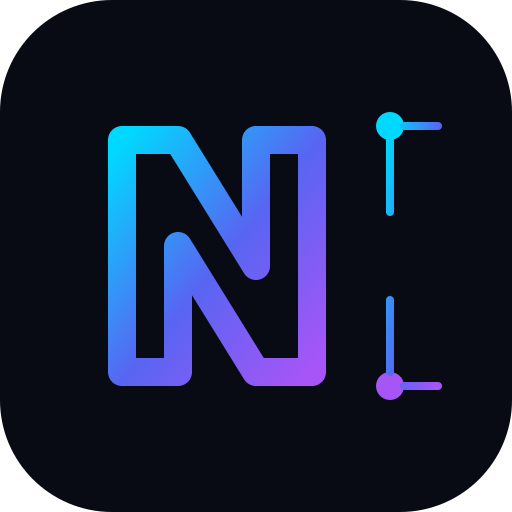

<div align="center>


# Ark-master

**Student · Self-taught Developer · Builder**

Software Engineering • Systems • AI • Cybersecurity • Computer Engineering

[](https://github.com/Ark-master-20)
[](#focus)
[](#how-i-learn)

</div>

---

## 👋 About

I'm a student and self-taught developer working toward strong, practical software-engineering skills.

My goal is not to collect technologies. I want to understand **how systems work, build useful things, investigate failures, and improve what I create**.

This profile is intentionally focused on **public work and public-facing information**. Private projects and unreleased ideas stay private until they are ready to be shared.

---

## 🎯 Focus

- 💻 Software engineering & programming
- 🌐 Web, databases & networking
- 🖥️ Computer systems & troubleshooting
- 🔐 Cybersecurity
- 🤖 AI & emerging technologies
- 🔌 Computer engineering, IoT & automation

---

## 🧰 Toolkit

**Languages**

`Python` · `C++` · `Java` · `JavaScript` · `PHP` · `HTML/CSS` · `SQL`

**Tools**

`VS Code` · `Git` · `GitHub` · `Ollama` · `Arduino` · `Wireshark`

My stack is evolving continuously. **The problem chooses the technology.**

---

## 🧠 How I Learn

```text
LEARN → UNDERSTAND → BUILD → TEST → BREAK
                         ↓
              DEBUG → DOCUMENT → IMPROVE
                         ↓
                      INTEGRATE
                         ↓
                       REPEAT
```

I prefer **understanding before abstraction** and **real projects before claiming mastery**.

I try to develop the full engineering cycle:

**Concept → Design → Build → Test → Debug → Secure → Document → Maintain**

---

## 🛠️ Engineering Mindset

> **Understand the foundation. Build something real. Break it. Debug it. Improve it.**

I care about:

- Clear fundamentals
- Dependency-aware learning
- Practical projects
- Testing and debugging
- Security and reliability
- Documentation
- Performance and maintainability
- Connecting software with the systems around it

---

## 🚀 Public Work

This profile will grow as projects become ready for public release.

**Private research stays private. Finished work gets published.**

[Explore my GitHub →](https://github.com/Ark-master-20)

---

<div align="center>

### ⚡ Learn deeply. Build boldly. Improve continuously.



**Building in public when it’s ready.**

</div>